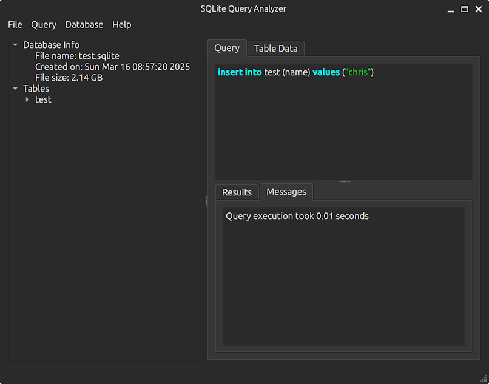

[](https://github.com/christianhelle/sqlitequery/actions/workflows/build.yml)

# SQLite Query Analyzer

SQLite Query Analyzer is a lightweight and efficient desktop utility designed to simplify the process of managing SQLite databases.

It provides an intuitive interface for executing queries and direct table editing, making database operations seamless and straightforward.

## Features

- Cross platform
- Easy-to-use interface for executing SQL queries
- Fast table data editing

## Screenshots

Here are some screenshots of SQLite Query Analyzer in action:

## Windows


## Linux (Ubuntu)





## Building

### Prerequisites

- CMake 3.16 or later - Install from [official website](https://cmake.org/download/)
- Qt 6.8.2 - Install from [official website](https://www.qt.io/download-qt-installer-oss)
- Git

### Clone the repository

```sh
git clone https://github.com/christianhelle/sqlitequery.git
cd sqlitequery
```

### Building on Linux

Install CMAke and Qt6

```sh
sudo apt-get update
sudo apt-get install -y cmake qt6-base-dev
```

Build project

```sh
cd src
cmake .
cmake --build . --config Release
```

### Building on MacOS

Install CMAke and Qt6

```sh
brew update
brew install cmake
brew install qt@6
```

Build project

```sh
cd src
cmake .
cmake --build . --config Release
```

Build MacOS disk image (Optional)

```sh
macdeployqt SQLiteQueryAnalyzer.app -dmg
```

### Building on Windows

Build the project (These instructions assumes that Qt root folder is C:\Qt)

```pwsh
cd src
cmake . -DCMAKE_PREFIX_PATH=C:/Qt/6.8.2/msvc2022_64 -DCMAKE_CXX_STANDARD=17 -DCMAKE_CXX_FLAGS="/Zc:__cplusplus /permissive-" -B build
cmake --build build --config Release
C:\Qt\6.8.2\msvc2022_64\bin\windeployqt.exe .\build\Release\SQLiteQueryAnalyzer.exe
```

Build the installer project using Inno Setup (Optional)

```pwsh
../deps/innosetup/ISCC.exe setup.iss
```

## Contributing

We welcome contributions to SQLite Query Analyzer! If you have any ideas, suggestions, or bug reports, please open an issue or submit a pull request on GitHub.
