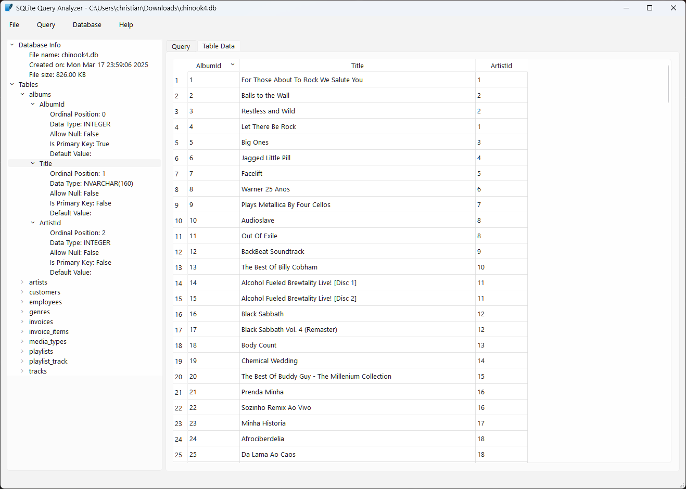
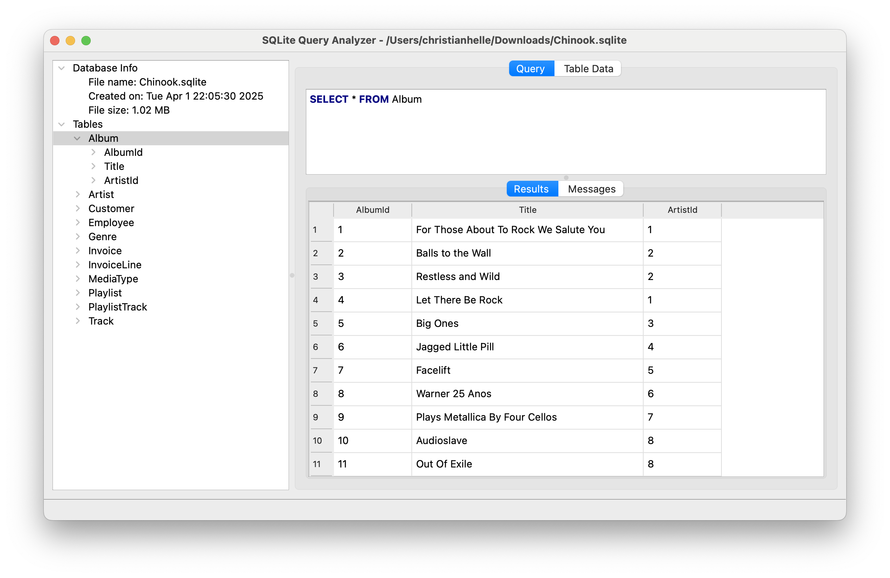
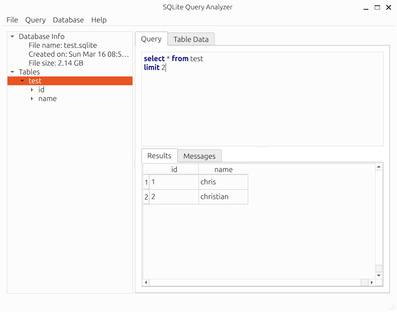

[](https://github.com/christianhelle/sqlitequery/actions/workflows/linux.yml)
[](https://github.com/christianhelle/sqlitequery/actions/workflows/macos.yml)
[](https://github.com/christianhelle/sqlitequery/actions/workflows/windows.yml)

[](https://sonarcloud.io/summary/new_code?id=christianhelle_sqlitequery)
[](https://sonarcloud.io/summary/new_code?id=christianhelle_sqlitequery)
[](https://sonarcloud.io/summary/new_code?id=christianhelle_sqlitequery)
[](https://sonarcloud.io/summary/new_code?id=christianhelle_sqlitequery)
[](https://sonarcloud.io/summary/new_code?id=christianhelle_sqlitequery)
[](https://sonarcloud.io/summary/new_code?id=christianhelle_sqlitequery)

# SQLite Query Analyzer

SQLite Query Analyzer is a lightweight and efficient desktop utility designed
to simplify the process of managing SQLite databases.

It provides an intuitive interface for executing queries and direct table editing,
making database operations seamless and straightforward.

## Features

- Cross platform - Runs natively on Windows, MacOS, and Linux
- Easy-to-use interface for executing SQL queries
- Fast table data editing
- Persists application state and reloads last session on startup
- Export database schema as CREATE TABLE statements
- Export data as an SQL script containing INSERT statements or as CSV files

## Screenshots

Here are some screenshots of SQLite Query Analyzer in action:

## Windows





## MacOS





## Linux (Ubuntu)





## Building

### Prerequisites

- CMake 3.16 or later - Install from [official website](https://cmake.org/download/)
- Qt 6.8.2 - Install from [official website](https://www.qt.io/download-qt-installer-oss)
- Git
- [Powershell Core](https://learn.microsoft.com/en-us/powershell/scripting/install/installing-powershell) (Optional)

### Clone the repository

```sh
git clone https://github.com/christianhelle/sqlitequery.git
cd sqlitequery
```

### Build the project using cross platform powershell script

```sh
cd src/project
pwsh build.ps1
```

### Building on Linux

Install CMAke and Qt6

```sh
sudo apt-get update
sudo apt-get install -y cmake qt6-base-dev
```

Build project

```sh
cd src/project
cmake .
cmake --build . --config Release
```

### Building on MacOS

Install CMAke and Qt6. It's recommended to install Qt using the [official installer](https://www.qt.io/download-qt-installer-oss)

```sh
brew update
brew install cmake
brew install qt@6
```

Build project

```sh
cd src/project
cmake .
cmake --build . --config Release
```

Build MacOS disk image (Optional). 

There is a bug in the Homebrew distribution of Qt which causes the use of `macdeployqt` to fail.

```sh
macdeployqt SQLiteQueryAnalyzer.app -dmg
```

### Building on Windows

Build the project (These instructions assumes that Qt root folder is C:\Qt)

```pwsh
cd src
cmake . -DCMAKE_PREFIX_PATH=C:/Qt/6.8.2/msvc2022_64 -DCMAKE_CXX_STANDARD=17 -DCMAKE_CXX_FLAGS="/Zc:__cplusplus /permissive-" -B build
cmake --build build --config Release
C:\Qt\6.8.2\msvc2022_64\bin\windeployqt.exe .\build\Release\SQLiteQueryAnalyzer.exe
```

Build the installer project using Inno Setup (Optional)

```pwsh
../deps/innosetup/ISCC.exe setup.iss
```

## Contributing

We welcome contributions to SQLite Query Analyzer!
If you have any ideas, suggestions, or bug reports,
please open an issue or submit a pull request on GitHub.
