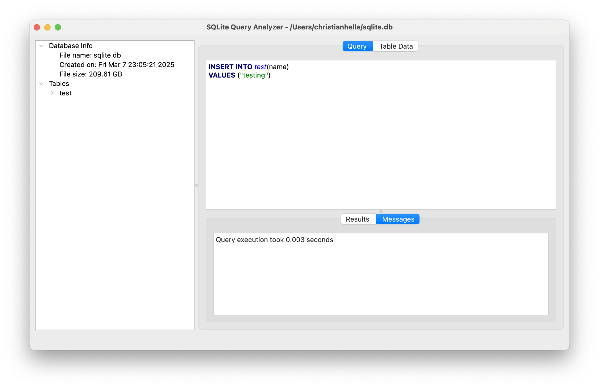
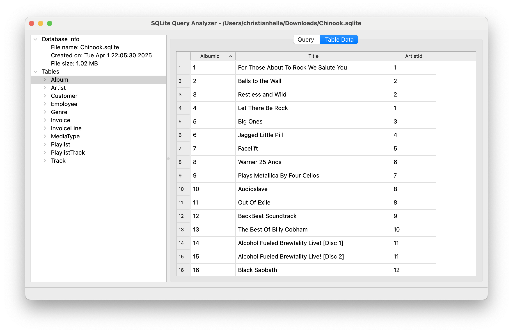
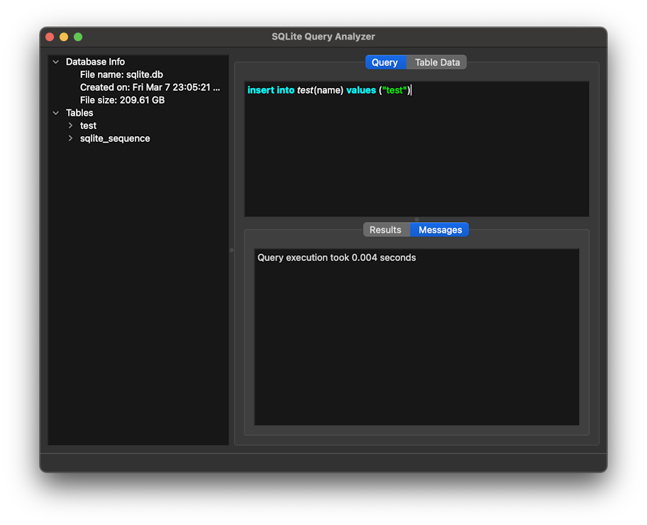
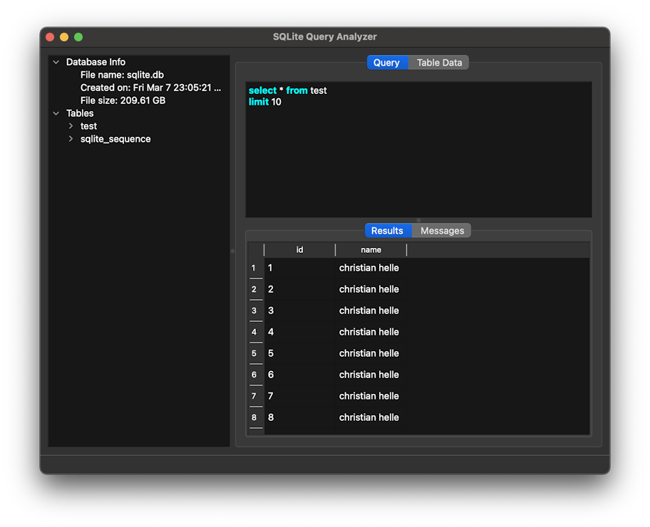

[](https://github.com/christianhelle/sqlitequery/actions/workflows/linux.yml)
[](https://github.com/christianhelle/sqlitequery/actions/workflows/macos.yml)
[](https://github.com/christianhelle/sqlitequery/actions/workflows/windows.yml)

[](https://sonarcloud.io/summary/new_code?id=christianhelle_sqlitequery)
[](https://sonarcloud.io/summary/new_code?id=christianhelle_sqlitequery)
[](https://sonarcloud.io/summary/new_code?id=christianhelle_sqlitequery)
[](https://sonarcloud.io/summary/new_code?id=christianhelle_sqlitequery)
[](https://sonarcloud.io/summary/new_code?id=christianhelle_sqlitequery)
[](https://sonarcloud.io/summary/new_code?id=christianhelle_sqlitequery)

# SQLite Query Analyzer

## Overview

SQLite Query Analyzer is a comprehensive, lightweight, and highly efficient cross-platform desktop application designed to simplify and streamline the complete workflow of managing, querying, analyzing, and manipulating SQLite databases. Built with modern C++ and the powerful Qt6 framework, this application delivers a professional-grade database management experience with both an intuitive graphical user interface (GUI) and a robust command-line interface (CLI) for automation and scripting purposes.

### What is SQLite Query Analyzer?

SQLite Query Analyzer serves as a complete database management solution for developers, database administrators, data analysts, and anyone working with SQLite databases. Whether you need to execute complex SQL queries, edit table data directly with a spreadsheet-like interface, export data for reporting, or automate database operations through scripts, this application provides all the tools necessary in a single, unified package.

The application is designed with performance, usability, and cross-platform compatibility in mind. It runs natively on Windows, macOS, and Linux operating systems without requiring Java, .NET, or any other runtime dependencies beyond the Qt libraries. The entire application is compiled to native machine code, ensuring optimal performance and minimal resource consumption.

### Key Design Principles

- **Cross-Platform First**: Truly native applications for Windows, macOS, and Linux with platform-specific optimizations
- **Performance Oriented**: Fast startup times, responsive UI, and efficient memory usage even with large databases
- **User-Friendly**: Intuitive interface that doesn't sacrifice power for simplicity
- **Automation Ready**: Full CLI support for scripting and integration with automated workflows
- **Standards Compliant**: Full support for SQLite 3.x with all modern SQL features
- **Modern Design**: Automatic dark/light theme switching based on system preferences
- **Privacy Focused**: All operations are performed locally with no telemetry or external connections

## Features

SQLite Query Analyzer offers a comprehensive suite of features designed to cover all aspects of SQLite database management and manipulation.

### Core Database Operations

#### Query Execution
- **Interactive SQL Editor**: Write and execute SQL queries with a full-featured text editor
- **Syntax Highlighting**: Color-coded SQL syntax for improved readability and reduced errors
- **Multi-Statement Support**: Execute multiple SQL statements in a single batch
- **Query Results Display**: View query results in a clean, sortable table format
- **Error Reporting**: Clear error messages with line numbers for debugging failed queries
- **Query History**: Automatic tracking of executed queries for quick reference

#### Direct Table Data Editing
- **Spreadsheet-Like Interface**: Edit table data directly in a familiar grid view
- **In-Place Editing**: Double-click cells to modify data without writing UPDATE statements
- **Add/Delete Rows**: Insert new records or remove existing ones with simple buttons
- **Data Type Awareness**: Proper handling of INTEGER, TEXT, REAL, BLOB, and NULL types
- **Instant Updates**: Changes are immediately committed to the database
- **Validation**: Built-in validation to prevent invalid data entry

#### Database Schema Management
- **Visual Schema Browser**: Tree view showing all tables, indexes, and triggers
- **Column Information**: View detailed column information including data types, constraints, and defaults
- **Index Visualization**: See all indexes and their associated columns
- **Schema Export**: Export complete database schema as CREATE TABLE statements
- **Table Analysis**: View table statistics and storage information

### Data Import/Export Capabilities

#### CSV Export
- **Bulk Export**: Export all database tables to individual CSV files with one command
- **Custom Delimiters**: Support for comma, tab, semicolon, and custom separators
- **Header Rows**: Optional column header rows in exported files
- **Encoding Support**: UTF-8, UTF-16, and other character encodings
- **Progress Tracking**: Real-time progress indicators for large exports
- **Selective Export**: Choose specific tables to export

#### SQL Script Export
- **Complete Database Dump**: Export entire database as a SQL script
- **INSERT Statements**: Generate INSERT statements for all data
- **Schema + Data**: Combined schema and data export in a single script
- **Transaction Wrapping**: Automatic BEGIN/COMMIT transaction blocks
- **Portable Scripts**: Generated scripts work on any SQLite-compatible system

### User Interface Features

#### Cross-Platform Native Experience
- **Windows**: Native Windows 10/11 look and feel with modern UI controls
- **macOS**: Full macOS integration with menu bar, dock, and Aqua interface
- **Linux**: GTK/KDE theme integration for seamless desktop environment blending
- **High DPI Support**: Crystal-clear display on 4K and Retina displays
- **Keyboard Shortcuts**: Comprehensive keyboard navigation for power users

#### Theme Management
- **Automatic Theme Switching**: Detects system dark/light mode and adjusts automatically
- **Dark Mode**: Full dark mode support for comfortable nighttime usage
- **Light Mode**: Clean, professional light theme for well-lit environments
- **Syntax Theme**: Syntax highlighting colors adapt to the current theme

#### Session Management
- **State Persistence**: Application remembers window size, position, and layout
- **Recent Files**: Quick access to recently opened databases
- **Auto-Reconnect**: Automatically reopens last database on startup
- **Query Preservation**: SQL editor content is saved between sessions
- **Tab State**: Remember which database objects were selected

### Command Line Interface (CLI)

#### Automation & Scripting
- **Headless Operation**: Full functionality without GUI for server environments
- **Script Execution**: Run SQL scripts from files against any database
- **Batch Processing**: Process multiple databases in automated workflows
- **CI/CD Integration**: Perfect for continuous integration and deployment pipelines
- **Exit Codes**: Proper exit codes for success/failure detection in scripts

#### Data Operations
- **CSV Export via CLI**: Export all tables to CSV files from command line
- **Progress Indicators**: Optional progress output for long-running operations
- **Directory Control**: Specify output directories for exported files
- **Quiet Mode**: Suppress output for silent batch processing
- **Error Reporting**: Detailed error messages written to stderr

### Performance & Efficiency

#### Optimized Operations
- **Lazy Loading**: Database objects loaded on-demand for fast startup
- **Efficient Queries**: Optimized query execution with prepared statements
- **Memory Management**: Minimal memory footprint even with large result sets
- **Background Processing**: Long-running operations don't freeze the UI
- **Cancellation Support**: Ability to cancel long-running queries and exports

#### Database Optimization
- **VACUUM Support**: Shrink database file size by removing free pages
- **Integrity Check**: Verify database integrity with built-in diagnostics
- **Index Analysis**: Analyze and optimize database indexes
- **Statistics**: View table row counts and storage usage

## Technology Stack

### Core Technologies

#### Qt Framework (Version 6.4.2+)
SQLite Query Analyzer is built on the Qt6 framework, one of the most mature and powerful cross-platform application development frameworks available. Qt provides:

- **Cross-Platform Abstraction**: Single codebase that compiles to native applications on Windows, macOS, and Linux
- **Native Look and Feel**: Platform-specific UI rendering for authentic user experience
- **QtCore**: Foundation classes including file I/O, threading, and data structures
- **QtGui**: GUI components and event handling
- **QtWidgets**: High-level UI widgets for complex interfaces
- **QtSql**: Database connectivity layer with SQLite driver

#### C++ (C++17 Standard)
The application is written in modern C++ leveraging:

- **Performance**: Compiled to native machine code for maximum speed
- **Memory Safety**: Smart pointers and RAII for automatic resource management
- **Standard Library**: Extensive use of STL containers and algorithms
- **Type Safety**: Strong typing prevents entire categories of bugs
- **Cross-Platform**: Portable C++ code works on all target platforms

#### SQLite (Version 3.x)
- **Embedded Database**: No separate server process required
- **ACID Compliance**: Full transaction support with rollback
- **Zero Configuration**: No setup or administration needed
- **Cross-Platform**: Database files portable between platforms
- **SQL-92 Compliant**: Standard SQL with useful extensions

### Build System & Tools

#### CMake (Version 3.16+)
- **Modern Build System**: Configuration-based build management
- **Multi-Generator Support**: Can generate Visual Studio, Xcode, Makefiles, and Ninja projects
- **Dependency Management**: Automatic detection of Qt and other dependencies
- **Cross-Compilation**: Support for building on one platform for another
- **CPack Integration**: Built-in packaging support for multiple formats

#### Supported Compilers
- **GCC 13.3+**: Primary compiler for Linux builds
- **Clang**: Alternative compiler with excellent diagnostics
- **MSVC 2022**: Visual Studio compiler for Windows
- **MinGW**: Alternative Windows compiler for cross-compilation
- **Apple Clang**: Xcode compiler for macOS

### Platform-Specific Technologies

#### Windows
- **Win32 API**: Native Windows integration
- **Visual Studio Toolchain**: Industry-standard development tools
- **Inno Setup**: Professional installer creation
- **WinDeployQt**: Automatic dependency collection and deployment

#### macOS
- **Cocoa**: Native macOS UI framework
- **AppKit**: macOS-specific UI components
- **Xcode**: Official macOS development environment
- **macdeployqt**: Automatic app bundle creation with dependencies
- **DMG Creation**: Disk image distribution format

#### Linux
- **X11/Wayland**: Support for both display servers
- **GTK/KDE Themes**: Automatic theme detection and integration
- **XKB**: Keyboard handling library
- **AppImage/Snap/Flatpak**: Multiple distribution formats
- **Debian/RPM Packages**: Native package formats for major distributions

## Architecture & Design

### Application Architecture

#### Model-View Architecture
The application follows Qt's Model-View pattern for clean separation of concerns:

```
┌─────────────────────────────────────────────────────────────┐
│                      Presentation Layer                       │
│  ┌──────────────┐  ┌──────────────┐  ┌──────────────┐       │
│  │  MainWindow  │  │  Highlighter │  │   Prompts    │       │
│  │    (GUI)     │  │ (SQL Colors) │  │  (Dialogs)   │       │
│  └──────────────┘  └──────────────┘  └──────────────┘       │
└─────────────────────────────────────────────────────────────┘
                            ↕
┌─────────────────────────────────────────────────────────────┐
│                      Business Logic Layer                     │
│  ┌──────────────┐  ┌──────────────┐  ┌──────────────┐       │
│  │  DbAnalyzer  │  │   DbQuery    │  │   DbExport   │       │
│  │  (Schema)    │  │ (Execution)  │  │ (CSV/SQL)    │       │
│  └──────────────┘  └──────────────┘  └──────────────┘       │
│  ┌──────────────┐  ┌──────────────┐                          │
│  │   DbTree     │  │  Settings    │                          │
│  │ (Navigation) │  │ (Persist)    │                          │
│  └──────────────┘  └──────────────┘                          │
└─────────────────────────────────────────────────────────────┘
                            ↕
┌─────────────────────────────────────────────────────────────┐
│                      Data Access Layer                        │
│  ┌──────────────┐  ┌──────────────┐  ┌──────────────┐       │
│  │   Database   │  │ DatabaseInfo │  │ RecentFiles  │       │
│  │ (Connection) │  │  (Metadata)  │  │   (State)    │       │
│  └──────────────┘  └──────────────┘  └──────────────┘       │
└─────────────────────────────────────────────────────────────┘
                            ↕
┌─────────────────────────────────────────────────────────────┐
│                      SQLite Database                          │
└─────────────────────────────────────────────────────────────┘
```

#### Component Overview

**GUI Components** (`src/gui/`)
- `MainWindow`: Central application window managing all UI interactions
- `Highlighter`: SQL syntax highlighting using Qt's QSyntaxHighlighter
- `Prompts`: Dialog boxes for user confirmations and input

**Database Layer** (`src/database/`)
- `Database`: Core database connection and query execution
- `DbAnalyzer`: Schema introspection and metadata extraction
- `DbQuery`: Query execution and result set management
- `DbExport`: Base class for export operations
- `DbSchemaExport`: Schema export to SQL CREATE statements
- `DbDataExport`: Data export to SQL INSERT statements and CSV
- `DbTree`: Database object tree navigation
- `DatabaseInfo`: Metadata container for tables, columns, indexes

**CLI Components** (`src/cli/`)
- `Export`: Command-line CSV export functionality
- `Script`: SQL script execution from files

**Settings Layer** (`src/settings/`)
- `Settings`: Application preferences and configuration
- `RecentFiles`: Recent file history management

**Threading** (`src/threading/`)
- `Cancellation`: Cancellation token pattern for async operations
- `MainThread`: Thread synchronization utilities

### Key Design Patterns

#### RAII (Resource Acquisition Is Initialization)
- Automatic resource cleanup using destructors
- Database connections automatically closed
- File handles automatically released
- No manual memory management required

#### Observer Pattern
- Qt's signals and slots for event handling
- Decoupled communication between components
- Type-safe callbacks at compile time

#### Command Pattern
- CLI commands encapsulated as objects
- Undo/redo support for table editing
- Command history for queries

#### Factory Pattern
- Export format selection
- Database driver instantiation
- Platform-specific UI components

## System Requirements

### Minimum Requirements

#### All Platforms
- **CPU**: 1 GHz processor or faster
- **RAM**: 512 MB available memory
- **Storage**: 50 MB available disk space for application
- **Display**: 1024x768 screen resolution

#### Windows
- **OS**: Windows 10 version 1809 (October 2018 Update) or later
- **Windows 11**: Fully supported with native UI
- **Architecture**: x64 (64-bit Intel/AMD processors)

#### macOS
- **OS**: macOS 11.0 (Big Sur) or later
- **Architecture**: Intel x86_64 or Apple Silicon (arm64)
- **Universal Binary**: Single download works on both Intel and Apple Silicon

#### Linux
- **Kernel**: Linux kernel 5.4 or later
- **Display Server**: X11 or Wayland
- **Architecture**: x86_64 (amd64)
- **Distributions**: Ubuntu 20.04+, Debian 11+, Fedora 35+, openSUSE Leap 15.3+, Arch Linux

### Recommended Requirements

- **CPU**: Multi-core processor (2+ cores) for better performance
- **RAM**: 2 GB for comfortable operation with large databases
- **Storage**: 100 MB with room for database files
- **Display**: 1920x1080 or higher for optimal UI experience

### Performance Characteristics

#### Startup Time
- Cold start: ~500ms on modern hardware
- Warm start: ~200ms with OS file cache

#### Memory Usage
- Base application: ~50 MB RAM
- Per open database: ~10-20 MB depending on schema size
- Query results: Depends on result set size, optimized with pagination

#### Database Size Limits
- Maximum database size: 281 TB (SQLite limit)
- Practical limit: Depends on available RAM and storage
- Tested with databases up to 100 GB
- Optimized for databases under 1 GB for best performance

## Installation

SQLite Query Analyzer is distributed in multiple formats to accommodate different platforms and user preferences.

### Windows Installation

#### Option 1: Windows Installer (Recommended)
1. Download `SQLiteQueryAnalyzer-Setup.exe` from the [latest release](https://github.com/christianhelle/sqlitequery/releases/latest)
2. Run the installer executable
3. Follow the installation wizard
4. Choose installation directory (default: `C:\Program Files\SQLite Query Analyzer`)
5. Optionally create desktop and start menu shortcuts
6. Launch from Start Menu or desktop icon

**Features:**
- Automatic file association for `.db`, `.sqlite`, `.sqlite3` files
- Windows context menu integration (right-click → Open with SQLite Query Analyzer)
- Automatic uninstaller creation
- Start menu entries

#### Option 2: Portable ZIP Archive
1. Download `SQLiteQueryAnalyzer-windows-x64.zip` from releases
2. Extract to any directory (no installation required)
3. Run `SQLiteQueryAnalyzer.exe` from the extracted folder
4. Ideal for USB drives or systems without admin rights

#### Option 3: Chocolatey Package Manager
```powershell
# Coming soon
choco install sqlitequery
```

### macOS Installation

#### Option 1: DMG Disk Image (Recommended)
1. Download `SQLiteQueryAnalyzer-macos-{architecture}.dmg` from releases
   - `arm64` for Apple Silicon (M1, M2, M3)
   - `intel` for Intel-based Macs
2. Open the downloaded DMG file
3. Drag `SQLiteQueryAnalyzer.app` to Applications folder
4. Launch from Applications or Spotlight
5. On first launch, you may need to right-click and select "Open" due to Gatekeeper

**Universal Binary**: Both Intel and Apple Silicon versions are code-signed and notarized by Apple.

#### Option 2: Homebrew Cask
```bash
# Coming soon
brew install --cask sqlitequery
```

### Linux Installation

#### Option 1: Snap Package (Universal)
```bash
# Install from Snap Store (works on all major distributions)
sudo snap install sqlitequery

# Run the application
sqlitequery
```

**Advantages:**
- Automatic updates
- Sandboxed security
- Works on Ubuntu, Debian, Fedora, Arch, and more
- Single package for all distributions

#### Option 2: AppImage (Portable)
```bash
# Download AppImage from releases
wget https://github.com/christianhelle/sqlitequery/releases/latest/download/SQLiteQueryAnalyzer-linux-x86_64.AppImage

# Make executable
chmod +x SQLiteQueryAnalyzer-linux-x86_64.AppImage

# Run directly
./SQLiteQueryAnalyzer-linux-x86_64.AppImage
```

**Advantages:**
- No installation required
- Run from anywhere
- No root access needed
- Works on any Linux distribution

#### Option 3: Debian Package (.deb)
```bash
# Download .deb package
wget https://github.com/christianhelle/sqlitequery/releases/latest/download/sqlitequery_1.0.0_amd64.deb

# Install on Debian/Ubuntu
sudo dpkg -i sqlitequery_1.0.0_amd64.deb
sudo apt-get install -f  # Install dependencies if needed

# Run
sqlitequery
```

**Supported:**
- Ubuntu 20.04 LTS and later
- Debian 11 (Bullseye) and later
- Linux Mint 20 and later
- Pop!_OS 20.04 and later

#### Option 4: RPM Package (.rpm)
```bash
# Download .rpm package
wget https://github.com/christianhelle/sqlitequery/releases/latest/download/sqlitequery-1.0.0-1.x86_64.rpm

# Install on Fedora/RHEL/CentOS
sudo dnf install sqlitequery-1.0.0-1.x86_64.rpm

# Or using yum
sudo yum install sqlitequery-1.0.0-1.x86_64.rpm

# Run
sqlitequery
```

**Supported:**
- Fedora 35 and later
- RHEL 8 and later
- CentOS Stream 8 and later
- Rocky Linux 8 and later
- AlmaLinux 8 and later

#### Option 5: Build From Source
See the [Building](#building) section below for detailed instructions.

### Verifying Installation

After installation, verify that SQLite Query Analyzer is working correctly:

#### GUI Verification
```bash
# Open a test database
sqlitequery /path/to/test.db
```

#### CLI Verification
```bash
# Check version
sqlitequery --version

# Display help
sqlitequery --help
```

## CLI Usage

SQLite Query Analyzer provides a comprehensive command-line interface for automation, scripting, and integration with other tools. The CLI offers the full power of the GUI in a scriptable, non-interactive format perfect for DevOps workflows, CI/CD pipelines, and batch processing.

### Command-Line Syntax

```
sqlitequery [options] database
```

### Available Options

### Available Options

| Option | Short | Description | Required Arguments |
|--------|-------|-------------|-------------------|
| `--help` | `-h` | Display help information and exit | None |
| `--help-all` | | Display all help including Qt-specific options | None |
| `--version` | `-v` | Display version information and exit | None |
| `--export-csv` | `-e` | Export all tables to CSV format | Database file |
| `--target-directory` | `-d` | Specify output directory for exports | Directory path |
| `--progress` | `-p` | Show progress indicators during operations | None |
| `--run-sql` | `-r` | Execute SQL commands from a file | SQL file, database file |

### Help Text

```sh
$ sqlitequery --help
Usage: /snap/sqlitequery/3/bin/SQLiteQueryAnalyzer [options] database
A fast and lightweight cross-platform command line and GUI tool for querying and manipulating SQLite databases

Options:
  -h, --help              Displays help on commandline options.
  --help-all              Displays help, including generic Qt options.
  -v, --version           Displays version information.
  -p, --progress          Show progress during copy
  -e, --export-csv        Export data to CSV.
  -d, --target-directory  Target directory for export.
  -r, --run-sql           Execute SQL file.

Arguments:
  database                Database file to open.
```

### Usage Examples

#### Opening a database in GUI mode

The simplest way to use SQLite Query Analyzer is to open a database file in the graphical interface:

```sh
# Open a database file
sqlitequery /path/to/database.db

# Open with absolute path
sqlitequery /home/user/data/app.sqlite

# Open with relative path
sqlitequery ../data/test.db
```

When opened in GUI mode, the application provides:
- Interactive SQL query editor with syntax highlighting
- Visual database schema browser
- Direct table data editing
- Export and import capabilities
- All features accessible through menus and toolbars

#### Exporting data to CSV files

Export all tables in a database to individual CSV files:

```sh
# Basic CSV export (outputs to current directory)
sqlitequery --export-csv /path/to/database.db

# Export with progress indicator (useful for large databases)
sqlitequery --export-csv --progress /path/to/database.db

# Export to a specific directory
sqlitequery --export-csv --target-directory /path/to/export/folder /path/to/database.db

# Combine progress and directory options
sqlitequery --export-csv --progress --target-directory ./exports /path/to/database.db
```

**Output Format:**
- One CSV file per table
- File naming: `{tablename}.csv`
- UTF-8 encoding
- Comma-separated values
- Header row with column names
- NULL values represented as empty strings

**Example Output:**
```
Exporting table 'users' to users.csv... Done (1,234 rows)
Exporting table 'orders' to orders.csv... Done (5,678 rows)
Exporting table 'products' to products.csv... Done (890 rows)
Total: 3 tables exported successfully
```

#### Executing SQL scripts

Run SQL commands from a file against a database:

```sh
# Execute a SQL script
sqlitequery --run-sql /path/to/script.sql /path/to/database.db

# Execute with relative paths
sqlitequery --run-sql ./migrations/001_create_tables.sql ./app.db

# Execute complex migrations
sqlitequery --run-sql /path/to/seed_data.sql /path/to/test_database.db
```

**Supported SQL Features:**
- Multiple statements in one file (separated by semicolons)
- Comments (both `--` and `/* */` style)
- Transaction blocks (BEGIN, COMMIT, ROLLBACK)
- DDL statements (CREATE, ALTER, DROP)
- DML statements (INSERT, UPDATE, DELETE, SELECT)
- SQLite-specific pragmas

**Example SQL Script:**
```sql
-- Create tables
CREATE TABLE IF NOT EXISTS users (
    id INTEGER PRIMARY KEY AUTOINCREMENT,
    username TEXT NOT NULL UNIQUE,
    email TEXT NOT NULL,
    created_at DATETIME DEFAULT CURRENT_TIMESTAMP
);

-- Insert test data
INSERT INTO users (username, email) VALUES ('alice', 'alice@example.com');
INSERT INTO users (username, email) VALUES ('bob', 'bob@example.com');

-- Create indexes
CREATE INDEX idx_users_email ON users(email);
```

#### Combining CLI with Shell Scripts

**Backup Script:**
```bash
#!/bin/bash
# backup_database.sh - Create dated backup with CSV exports

DATE=$(date +%Y%m%d_%H%M%S)
BACKUP_DIR="./backups/$DATE"

mkdir -p "$BACKUP_DIR"
cp database.db "$BACKUP_DIR/"
sqlitequery --export-csv --target-directory "$BACKUP_DIR/csv" database.db

echo "Backup completed: $BACKUP_DIR"
```

**Data Migration Script:**
```bash
#!/bin/bash
# migrate.sh - Apply migrations and export results

for migration in migrations/*.sql; do
    echo "Applying $migration..."
    sqlitequery --run-sql "$migration" production.db
    if [ $? -ne 0 ]; then
        echo "Migration failed: $migration"
        exit 1
    fi
done

echo "Exporting updated database..."
sqlitequery --export-csv --target-directory ./exports production.db
```

**Automated Testing:**
```bash
#!/bin/bash
# test_database.sh - Run test queries and verify results

# Create test database
sqlitequery --run-sql test_schema.sql test.db

# Run test data population
sqlitequery --run-sql test_data.sql test.db

# Export results for verification
sqlitequery --export-csv --target-directory ./test_results test.db

# Verify exported data (example with grep)
if grep -q "expected_value" test_results/users.csv; then
    echo "Test passed"
    exit 0
else
    echo "Test failed"
    exit 1
fi
```

### CLI Features

- **Export to CSV**: Export all database tables to individual CSV files
  - Automatically creates one file per table
  - Preserves data types as text representations
  - Handles special characters and newlines in data
  - Supports large tables with millions of rows
  
- **Execute SQL Scripts**: Run SQL scripts from files against a database
  - Transactional execution (all-or-nothing)
  - Detailed error reporting with line numbers
  - Support for complex multi-statement scripts
  - Rollback on error to preserve data integrity
  
- **Progress Reporting**: Show progress indicators for long-running operations
  - Real-time row count updates
  - Estimated time remaining
  - Percentage completion
  - Cancellable operations (Ctrl+C)
  
- **Flexible Output**: Specify custom directories for exported files
  - Relative or absolute paths
  - Automatic directory creation
  - Overwrite protection with warnings
  - Disk space validation before export

### Exit Codes

The CLI follows standard Unix exit code conventions:

- **0**: Success - Operation completed without errors
- **1**: Error - General error (database not found, SQL error, etc.)
- **2**: Usage Error - Invalid command-line arguments
- **130**: Interrupted - Operation cancelled by user (Ctrl+C)

**Example Usage in Scripts:**
```bash
sqlitequery --export-csv database.db
if [ $? -eq 0 ]; then
    echo "Export successful"
else
    echo "Export failed with code $?"
    exit 1
fi
```

### Environment Variables

The following environment variables can affect CLI behavior:

- `QT_QPA_PLATFORM`: Set to `offscreen` for truly headless operation
- `LC_ALL`: Character encoding for text output (recommend `en_US.UTF-8`)
- `LANG`: System language for error messages
- `TMPDIR`: Temporary directory for intermediate files

**Example Headless Usage:**
```bash
# Run completely headless (no GUI libraries required)
QT_QPA_PLATFORM=offscreen sqlitequery --export-csv database.db
```

## Screenshots

Here are detailed screenshots of SQLite Query Analyzer in action across different platforms and themes. The application provides a consistent experience while respecting each platform's native look and feel.

### Windows

**Query Execution - Light Mode**

*Executing INSERT statements with syntax highlighting. The SQL editor provides real-time syntax coloring and error detection.*


*Running SELECT queries with results displayed in a sortable table. Column headers are clickable for sorting.*

**Table Data Editing - Light Mode**

*Direct table data editing with a spreadsheet-like interface. Double-click any cell to edit, add rows with the toolbar, or delete selected rows.*

**Dark Mode Interface**

*The application automatically switches to dark mode based on Windows theme settings, reducing eye strain in low-light environments.*


*Query results in dark mode with optimized colors for better readability.*


*Table editing in dark mode preserves full functionality while providing a comfortable viewing experience.*

### MacOS

**Query Execution - Light Mode**

*macOS native Aqua interface with familiar menu bar and window controls.*


*Query results with macOS-style table rendering and scrollbars.*

**Table Data Editing - Light Mode**

*Native macOS table editing experience with familiar keyboard shortcuts (⌘C, ⌘V, ⌘X).*

**Dark Mode Interface**

*Automatic dark mode switching synchronized with macOS system preferences.*


*Dark mode optimized for MacBook Pro and other Retina displays.*


*Table editing in dark mode maintains perfect contrast and readability.*

### Linux (Ubuntu)

**Query Execution - Light Mode**

*Clean integration with Ubuntu's default GNOME theme.*


*Results table with Linux-native fonts and styling.*

**Table Data Editing - Light Mode**

*Spreadsheet-style editing fits naturally into the Ubuntu desktop environment.*

**Dark Mode Interface**

*Automatic dark mode synchronization with Ubuntu's dark theme preference.*


*Query execution in dark mode with optimized syntax highlighting colors.*


*Dark mode table editing reduces glare on Linux desktops.*

## Building

SQLite Query Analyzer uses CMake as its primary build system, providing a consistent build experience across all platforms. The build process is designed to be simple and straightforward, with minimal dependencies and clear instructions for each platform.

### Prerequisites

### Prerequisites

Before building SQLite Query Analyzer, ensure you have the following tools installed:

- **Git**: Version control system for cloning the repository
  - Install from [git-scm.com](https://git-scm.com/downloads)
  - Minimum version: 2.0 or later
  - Used for: Cloning source code and managing changes

- **CMake**: Cross-platform build system generator
  - Install from [official website](https://cmake.org/download/)
  - Minimum version: 3.16 (Ubuntu 20.04 default)
  - Recommended version: 3.20 or later for best compatibility
  - Used for: Generating platform-specific build files

- **Qt Framework**: Cross-platform application framework
  - Minimum version: Qt 6.4.2 (Ubuntu 24.04 default)
  - Recommended version: Qt 6.9.0 for latest features
  - Install from [official website](https://www.qt.io/download-qt-installer-oss)
  - Required components: QtCore, QtGui, QtWidgets, QtSql
  - Optional but recommended: Qt Creator IDE

#### Platform-Specific Requirements

**Windows:**
- Visual Studio 2019 or later with C++ desktop development workload
- Windows 10 SDK (included with Visual Studio)
- Qt MSVC 2022 64-bit binaries

**macOS:**
- Xcode 13.0 or later
- Xcode Command Line Tools: `xcode-select --install`
- Homebrew (recommended for Qt installation): [brew.sh](https://brew.sh)

**Linux (Debian/Ubuntu):**
- GCC 9.0 or later (or Clang 10.0+)
- Make or Ninja build system
- Development headers: `build-essential`, `libxkbcommon-dev`

#### Optional Tools

- **PowerShell Core**: Cross-platform automation and scripting
  - Install from [Microsoft Docs](https://learn.microsoft.com/en-us/powershell/scripting/install/installing-powershell)
  - Used for: Simplified cross-platform build script (`build.ps1`)
  - Not required if using native build commands

- **Qt Creator**: Integrated development environment
  - Install from [Qt website](https://www.qt.io/download-qt-installer-oss)
  - Used for: Visual development, debugging, and UI editing
  - Recommended for contributors

- **clang-format**: Code formatting tool
  - Install via package manager or with LLVM
  - Used for: Maintaining consistent code style
  - Required for: Contributing code to the project

### Clone the repository

First, clone the repository from GitHub:

```sh
# Clone using HTTPS
git clone https://github.com/christianhelle/sqlitequery.git
cd sqlitequery

# Or clone using SSH (if you have SSH keys configured)
git clone git@github.com:christianhelle/sqlitequery.git
cd sqlitequery

# Verify the clone
git status
git log --oneline -5
```

The repository structure:
```
sqlitequery/
├── src/               # Source code
│   ├── main.cpp      # Application entry point
│   ├── gui/          # GUI components
│   ├── database/     # Database operations
│   ├── cli/          # Command-line interface
│   ├── settings/     # Application settings
│   ├── threading/    # Threading utilities
│   └── project/      # Build configuration
│       ├── CMakeLists.txt
│       ├── build.sh
│       └── build.ps1
├── images/           # Screenshots
├── docs/             # Documentation
└── README.md        # This file
```

### Build the project using cross platform powershell script

The easiest way to build on any platform is using the PowerShell build script:

```sh
# Navigate to the project directory
cd src/project

# Run the build script (works on Windows, macOS, and Linux)
pwsh build.ps1

# The script will:
# 1. Detect your platform automatically
# 2. Configure CMake with appropriate settings
# 3. Build the project in Release mode
# 4. Install to platform-specific directory
# 5. Handle Qt deployment automatically
```

**Build Output Locations:**
- **macOS**: `src/project/build/SQLiteQueryAnalyzer.app`
- **Linux**: `src/project/build/SQLiteQueryAnalyzer`
- **Windows**: `src/project/build/Release/SQLiteQueryAnalyzer.exe`

The PowerShell script automatically:
- Detects the operating system
- Finds the Qt installation
- Sets up the build environment
- Compiles with optimal settings
- Runs deployment tools (windeployqt, macdeployqt, etc.)

### Building on Linux

#### Ubuntu/Debian

Install dependencies:

```sh
# Update package lists
sudo apt-get update

# Install required packages
sudo apt-get install -y \
    build-essential \
    cmake \
    qt6-base-dev \
    libxkbcommon-dev \
    git

# Optional: Install Qt Creator for development
sudo apt-get install -y qtcreator

# Verify installations
cmake --version
qmake6 --version
gcc --version
```

Build the project using CMake:

```sh
# Navigate to project directory
cd src/project

# Option 1: Using the provided shell script (recommended)
chmod +x build.sh
./build.sh

# Option 2: Manual CMake commands
cmake -B build -DCMAKE_BUILD_TYPE=Release -DCMAKE_INSTALL_PREFIX=./linux/
cmake --build build --config Release --parallel $(nproc)
cmake --install build

# Run the application
./linux/bin/SQLiteQueryAnalyzer
```

**Build Configuration Options:**
```sh
# Debug build with symbols
cmake -B build -DCMAKE_BUILD_TYPE=Debug

# Custom install location
cmake -B build -DCMAKE_INSTALL_PREFIX=/opt/sqlitequery

# Specify Qt path if not found automatically
cmake -B build -DCMAKE_PREFIX_PATH=/path/to/Qt/6.9.0/gcc_64

# Use Ninja generator for faster builds
cmake -B build -G Ninja

# Verbose build output
cmake --build build --verbose
```

#### Fedora/RHEL/CentOS

```sh
# Install dependencies
sudo dnf install -y \
    gcc-c++ \
    cmake \
    qt6-qtbase-devel \
    libxkbcommon-devel \
    git

# Build
cd src/project
./build.sh
```

#### Arch Linux

```sh
# Install dependencies
sudo pacman -S --needed \
    base-devel \
    cmake \
    qt6-base \
    libxkbcommon \
    git

# Build
cd src/project
./build.sh
```

**Creating Linux Packages:**

```sh
# Navigate to build directory
cd src/project/build

# Generate .deb package (Debian/Ubuntu)
cpack -G DEB

# Generate .rpm package (Fedora/RHEL)
cpack -G RPM

# Generate .tar.gz archive
cpack -G TGZ

# Generate compressed archives
cpack -G ZIP  # ZIP archive
cpack -G 7Z   # 7-Zip archive

# All packages will be created in the build directory
ls -lh *.deb *.rpm *.tar.gz *.zip
```

### Building on MacOS

#### Install Prerequisites

Using Homebrew (recommended):

```sh
# Install Homebrew if not already installed
/bin/bash -c "$(curl -fsSL https://raw.githubusercontent.com/Homebrew/install/HEAD/install.sh)"

# Install dependencies
brew update
brew install cmake
brew install qt@6

# Add Qt to PATH (add this to ~/.zshrc or ~/.bash_profile)
export PATH="/usr/local/opt/qt@6/bin:$PATH"
export Qt6_DIR="/usr/local/opt/qt@6/lib/cmake/Qt6"

# Reload shell configuration
source ~/.zshrc  # or ~/.bash_profile
```

Alternative: Using Qt official installer (recommended for development):
1. Download from [qt.io/download](https://www.qt.io/download-qt-installer-oss)
2. Run the installer
3. Select Qt 6.9.0 for macOS
4. Choose installation path (e.g., `~/Qt`)

#### Build Project

```sh
# Navigate to project directory
cd src/project

# Option 1: Using build script
chmod +x build.sh
./build.sh

# Option 2: Manual CMake commands
cmake -B build -DCMAKE_BUILD_TYPE=Release
cmake --build build --config Release

# Run the application
open build/SQLiteQueryAnalyzer.app
```

#### Creating macOS Disk Image (Optional)

**Note**: There is a known issue with the Homebrew Qt distribution that prevents `macdeployqt` from working correctly. Use the official Qt installer for disk image creation.

```sh
# Navigate to build directory
cd build

# Create deployable app bundle
/path/to/Qt/6.9.0/macos/bin/macdeployqt SQLiteQueryAnalyzer.app -dmg

# This creates SQLiteQueryAnalyzer.dmg
# The DMG file can be distributed and installed on any macOS system
```

**Manual Deployment:**
```sh
# Copy Qt frameworks manually if macdeployqt fails
mkdir -p SQLiteQueryAnalyzer.app/Contents/Frameworks
cp -R /path/to/Qt/6.9.0/macos/lib/QtCore.framework SQLiteQueryAnalyzer.app/Contents/Frameworks/
cp -R /path/to/Qt/6.9.0/macos/lib/QtGui.framework SQLiteQueryAnalyzer.app/Contents/Frameworks/
cp -R /path/to/Qt/6.9.0/macos/lib/QtWidgets.framework SQLiteQueryAnalyzer.app/Contents/Frameworks/
cp -R /path/to/Qt/6.9.0/macos/lib/QtSql.framework SQLiteQueryAnalyzer.app/Contents/Frameworks/
```

### Building on Windows

#### Install Prerequisites

1. **Visual Studio 2022** (Community Edition is free)
   - Download from [visualstudio.microsoft.com](https://visualstudio.microsoft.com/)
   - During installation, select "Desktop development with C++"
   - Ensure Windows 10/11 SDK is selected

2. **CMake**
   - Download from [cmake.org/download](https://cmake.org/download/)
   - During installation, select "Add CMake to system PATH"

3. **Qt 6.9.0**
   - Download from [qt.io/download](https://www.qt.io/download-qt-installer-oss)
   - During installation, select:
     - Qt 6.9.0 → MSVC 2022 64-bit
     - Qt Creator (optional but recommended)
     - Qt Design Studio (optional)

#### Build Project

Using PowerShell (recommended):

```powershell
# Open PowerShell or Windows Terminal
cd src/project

# Option 1: Using build script (automatic configuration)
pwsh build.ps1

# Option 2: Manual CMake commands
# Assuming Qt is installed in C:\Qt
cmake -B build `
    -DCMAKE_PREFIX_PATH=C:/Qt/6.9.0/msvc2022_64 `
    -DCMAKE_CXX_STANDARD=17 `
    -DCMAKE_CXX_FLAGS="/Zc:__cplusplus /permissive-" `
    -G "Visual Studio 17 2022" `
    -A x64

# Build
cmake --build build --config Release --parallel

# Deploy Qt dependencies
C:\Qt\6.9.0\msvc2022_64\bin\windeployqt.exe .\build\Release\SQLiteQueryAnalyzer.exe

# Run the application
.\build\Release\SQLiteQueryAnalyzer.exe
```

Using Visual Studio:

```powershell
# Generate Visual Studio solution
cmake -B build -DCMAKE_PREFIX_PATH=C:/Qt/6.9.0/msvc2022_64

# Open in Visual Studio
start build\SQLiteQueryAnalyzer.sln

# Or build from command line
msbuild build\SQLiteQueryAnalyzer.sln /p:Configuration=Release /m
```

#### Build the Installer (Optional)

SQLite Query Analyzer uses Inno Setup to create a professional Windows installer:

```powershell
# Install Inno Setup (one-time setup)
# Download from https://jrsoftware.org/isdl.php
# Or use Chocolatey:
choco install innosetup

# Navigate to project directory
cd src/project

# Compile the installer script
..\deps\innosetup\ISCC.exe setup.iss

# The installer will be created in ..\artifacts\
# File: SQLiteQueryAnalyzer-Setup.exe
```

**Installer Features:**
- Start menu shortcuts
- Desktop shortcut (optional)
- File associations for .db, .sqlite, .sqlite3
- Context menu integration
- Automatic uninstaller
- Silent install option: `SQLiteQueryAnalyzer-Setup.exe /SILENT`

### Build Troubleshooting

#### Qt Not Found

**Problem**: CMake cannot find Qt installation

**Solution**:
```sh
# Specify Qt path explicitly
cmake -B build -DCMAKE_PREFIX_PATH=/path/to/Qt/6.9.0/gcc_64  # Linux
cmake -B build -DCMAKE_PREFIX_PATH=/path/to/Qt/6.9.0/macos   # macOS
cmake -B build -DCMAKE_PREFIX_PATH=C:/Qt/6.9.0/msvc2022_64  # Windows
```

#### Build Fails with Missing Headers

**Problem**: Cannot find Qt headers or SQLite

**Solution**: Install development packages
```sh
# Ubuntu/Debian
sudo apt-get install qt6-base-dev qt6-base-private-dev

# Fedora
sudo dnf install qt6-qtbase-devel

# macOS
brew reinstall qt@6
```

#### Permission Denied on Linux

**Problem**: Cannot execute build.sh

**Solution**:
```sh
chmod +x build.sh
./build.sh
```

#### Windows: LNK1104 Cannot Open Qt DLLs

**Problem**: Linker cannot find Qt libraries

**Solution**: Ensure Qt path is in CMAKE_PREFIX_PATH and rebuild:
```powershell
Remove-Item -Recurse -Force build
cmake -B build -DCMAKE_PREFIX_PATH=C:/Qt/6.9.0/msvc2022_64
cmake --build build --config Release
```

### Build Performance Tips

- **Parallel Builds**: Use `-j` flag to speed up compilation
  ```sh
  cmake --build build --parallel $(nproc)  # Linux/macOS
  cmake --build build --parallel %NUMBER_OF_PROCESSORS%  # Windows
  ```

- **Ninja Generator**: Faster than Unix Makefiles or Visual Studio
  ```sh
  cmake -B build -G Ninja
  ```

- **ccache**: Cache compiler outputs (Linux/macOS)
  ```sh
  sudo apt-get install ccache  # Ubuntu
  export CC="ccache gcc"
  export CXX="ccache g++"
  ```

- **Incremental Builds**: Only rebuild changed files
  ```sh
  cmake --build build  # Automatically detects what changed
  ```

## Development Workflow

### Code Style and Formatting

SQLite Query Analyzer follows a consistent coding style to maintain readability and quality.

#### Formatting Standards

- **Style Guide**: LLVM coding style
- **Configuration**: `.clang-format` file in the `src/` directory
- **Line Length**: 120 characters maximum
- **Indentation**: 4 spaces (no tabs)
- **Braces**: Opening brace on same line for functions and control structures

#### Formatting Code

Before committing changes, format your code:

```sh
# Format all C++ files
find src -name '*.cpp' -o -name '*.h' | xargs clang-format -i

# Check formatting without modifying files
clang-format --dry-run --Werror src/**/*.cpp src/**/*.h

# Format specific files
clang-format -i src/gui/mainwindow.cpp src/gui/mainwindow.h
```

### Development Tools

#### Qt Creator Setup

1. Open `src/project/CMakeLists.txt` in Qt Creator
2. Configure kit (Qt 6.9.0, GCC/Clang/MSVC)
3. Enable "Run CMake" on file changes
4. Set build directory to `src/project/build`
5. Configure debugger (GDB on Linux, LLDB on macOS, MSVC Debugger on Windows)

#### Visual Studio Code Setup

Install recommended extensions:
- C/C++ (Microsoft)
- CMake Tools (Microsoft)
- Qt tools (tonka3000)
- GitLens

Create `.vscode/settings.json`:
```json
{
  "cmake.sourceDirectory": "${workspaceFolder}/src/project",
  "cmake.buildDirectory": "${workspaceFolder}/src/project/build",
  "C_Cpp.default.configurationProvider": "ms-vscode.cmake-tools"
}
```

### Debugging

#### Debug Builds

```sh
# Build with debug symbols
cmake -B build -DCMAKE_BUILD_TYPE=Debug
cmake --build build

# Run with debugger
gdb ./build/SQLiteQueryAnalyzer              # Linux
lldb ./build/SQLiteQueryAnalyzer.app        # macOS
devenv /debugexe .\build\Debug\SQLiteQueryAnalyzer.exe  # Windows
```

#### Common Debug Scenarios

**Debugging GUI Issues:**
```sh
# Enable Qt debug output
export QT_DEBUG_PLUGINS=1
export QT_LOGGING_RULES="*.debug=true"
./SQLiteQueryAnalyzer
```

**Debugging Database Operations:**
- Set breakpoints in `src/database/database.cpp`
- Watch SQL statements before execution
- Inspect result sets

**Memory Leaks:**
```sh
# Linux: Use Valgrind
valgrind --leak-check=full ./SQLiteQueryAnalyzer

# macOS: Use Instruments
instruments -t Leaks ./SQLiteQueryAnalyzer.app
```

### Testing

#### Manual Testing Checklist

**Database Operations:**
- [ ] Open various database files (.db, .sqlite, .sqlite3)
- [ ] Execute simple SELECT queries
- [ ] Execute INSERT/UPDATE/DELETE statements
- [ ] Execute CREATE/ALTER/DROP statements
- [ ] Test with large result sets (>10,000 rows)
- [ ] Test with various data types (INTEGER, TEXT, REAL, BLOB, NULL)

**Table Editing:**
- [ ] Edit text fields
- [ ] Edit numeric fields
- [ ] Set values to NULL
- [ ] Add new rows
- [ ] Delete rows
- [ ] Verify changes persist after closing

**Export Functionality:**
- [ ] Export all tables to CSV
- [ ] Export schema to SQL
- [ ] Export data to SQL INSERT statements
- [ ] Verify exported files are valid

**CLI Testing:**
- [ ] `--help` displays usage information
- [ ] `--version` shows version number
- [ ] `--export-csv` creates CSV files
- [ ] `--run-sql` executes scripts correctly
- [ ] Error handling for invalid inputs

**Theme Switching:**
- [ ] Application starts in correct theme
- [ ] Switching system theme updates app theme
- [ ] Syntax highlighting adapts to theme
- [ ] All UI elements visible in both themes

## Configuration and Settings

### Application Settings

SQLite Query Analyzer stores user preferences using Qt's QSettings API.

**Settings Location:**
- **Windows**: `HKEY_CURRENT_USER\Software\Christian Helle\SQLite Query Analyzer`
- **macOS**: `~/Library/Preferences/com.christianhelle.SQLiteQueryAnalyzer.plist`
- **Linux**: `~/.config/Christian Helle/SQLite Query Analyzer.conf`

**Stored Preferences:**
- Window size and position
- Last opened database path
- Recent files list (up to 10 files)
- SQL editor content (auto-saved)
- Selected database object in tree view
- Export preferences (last directory, format)

### Configuration Files

#### clang-format Configuration

Located at `src/.clang-format`:
- Based on LLVM style
- 120 character line limit
- 4-space indentation
- Automatic formatting rules

#### CMake Configuration

Main configuration in `src/project/CMakeLists.txt`:
- Minimum CMake version: 3.16
- C++17 standard required
- Qt6 components: Core, Gui, Widgets, Sql
- Platform-specific build options
- CPack packaging configuration

## Troubleshooting

### Common Runtime Issues

#### Application Won't Start

**Symptom**: Application crashes immediately or fails to open

**Possible Causes & Solutions:**

1. **Missing Qt libraries**
   ```sh
   # Linux: Check library dependencies
   ldd ./SQLiteQueryAnalyzer
   # Install missing libraries
   sudo apt-get install qt6-base-gui
   ```

2. **Missing database file**
   ```sh
   # Don't open app with non-existent database
   # Check file exists before opening
   ls -l /path/to/database.db
   ```

3. **Corrupted settings**
   ```sh
   # Reset application settings
   # Linux
   rm ~/.config/Christian\ Helle/SQLite\ Query\ Analyzer.conf
   # macOS
   rm ~/Library/Preferences/com.christianhelle.SQLiteQueryAnalyzer.plist
   # Windows (PowerShell)
   Remove-Item "HKCU:\Software\Christian Helle\SQLite Query Analyzer"
   ```

#### Database Opens but Appears Empty

**Symptom**: Database file opens but no tables are shown

**Possible Causes & Solutions:**

1. **Empty database file**
   - Check if database actually contains tables
   ```sh
   sqlite3 database.db ".tables"
   ```

2. **Corrupted database**
   - Run integrity check
   ```sh
   sqlite3 database.db "PRAGMA integrity_check;"
   ```

3. **Wrong file type**
   - Verify it's actually an SQLite database
   ```sh
   file database.db
   # Should output: SQLite 3.x database
   ```

#### Queries Execute But Show No Results

**Symptom**: SELECT queries run without errors but results table is empty

**Possible Causes & Solutions:**

1. **Table is actually empty**
   ```sql
   SELECT COUNT(*) FROM tablename;
   ```

2. **WHERE clause filters all rows**
   - Review your WHERE conditions
   - Try SELECT without WHERE first

3. **Results table not refreshed**
   - Click refresh button
   - Re-execute query

#### Export Fails or Creates Empty Files

**Symptom**: Export operation completes but files are empty or missing

**Possible Causes & Solutions:**

1. **Permission denied**
   ```sh
   # Check directory permissions
   ls -ld /export/directory
   # Create directory if needed
   mkdir -p /export/directory
   chmod 755 /export/directory
   ```

2. **Disk space full**
   ```sh
   df -h .
   ```

3. **Table has no data**
   ```sql
   SELECT COUNT(*) FROM tablename;
   ```

### Platform-Specific Issues

#### Linux: Could Not Connect to Display

**Symptom**: Error message about display when running CLI

**Solution**: Use headless mode
```sh
QT_QPA_PLATFORM=offscreen sqlitequery --export-csv database.db
```

#### macOS: App is Damaged and Can't Be Opened

**Symptom**: Gatekeeper prevents opening the application

**Solution**: Allow unsigned apps
```sh
xattr -cr /Applications/SQLiteQueryAnalyzer.app
```

Or right-click and select "Open" the first time.

#### Windows: VCRUNTIME140.dll Missing

**Symptom**: Error about missing Visual C++ runtime

**Solution**: Install Visual C++ Redistributable
1. Download from [Microsoft](https://learn.microsoft.com/en-us/cpp/windows/latest-supported-vc-redist)
2. Install `vc_redist.x64.exe`
3. Restart computer

### Getting Help

If you encounter issues not covered here:

1. **Check existing issues**: [GitHub Issues](https://github.com/christianhelle/sqlitequery/issues)
2. **Search closed issues**: Someone may have solved it before
3. **Check discussions**: [GitHub Discussions](https://github.com/christianhelle/sqlitequery/discussions)
4. **Create new issue**: Provide:
   - Operating system and version
   - Qt version
   - SQLite version
   - Complete error message
   - Steps to reproduce
   - Database file (if relevant and not sensitive)

## FAQ

### General Questions

**Q: Is SQLite Query Analyzer free?**
A: Yes, it's completely free and open source under the Unlicense license.

**Q: What databases does it support?**
A: Only SQLite databases (versions 3.x). It doesn't support MySQL, PostgreSQL, or other databases.

**Q: Can I use it for commercial projects?**
A: Yes, the Unlicense allows use for any purpose including commercial applications.

**Q: Does it require an internet connection?**
A: No, all operations are performed locally on your computer.

**Q: Is my data safe?**
A: Yes. The application doesn't send any data to external servers. Everything stays on your machine.

### Features & Capabilities

**Q: Can it handle large databases?**
A: Yes, it's tested with databases up to 100 GB. Performance depends on your hardware.

**Q: Does it support encrypted databases?**
A: No, SQLite Query Analyzer doesn't currently support SQLCipher or other encrypted database formats.

**Q: Can I import data from CSV files?**
A: Currently, only export to CSV is supported. Import functionality may be added in future versions.

**Q: Does it support multiple databases simultaneously?**
A: No, you can only work with one database at a time. However, you can open multiple instances of the application.

**Q: Can I execute multiple queries at once?**
A: Yes, you can write multiple SQL statements separated by semicolons in the editor and execute them all.

### Installation & Compatibility

**Q: Which Windows versions are supported?**
A: Windows 10 (version 1809) and later, including Windows 11.

**Q: Will it work on older Linux distributions?**
A: It requires Qt 6.4.2+, so distributions released after 2022 work best. Ubuntu 20.04+ is recommended.

**Q: Does it work on Apple Silicon (M1/M2/M3) Macs?**
A: Yes, there are native ARM64 builds optimized for Apple Silicon.

**Q: Can I run it on a Raspberry Pi?**
A: Potentially yes on 64-bit Raspberry Pi OS, but performance may be limited. ARM64 builds would be needed.

### Usage & Workflow

**Q: How do I open multiple databases?**
A: Launch multiple instances of the application, each can open a different database.

**Q: Can I undo changes made to table data?**
A: No, changes are committed immediately. Always backup important databases before editing.

**Q: How do I backup my database?**
A: Simply copy the .db file, or use the export features to create SQL or CSV backups.

**Q: Can I schedule automated exports?**
A: Yes, use the CLI with cron (Linux/macOS) or Task Scheduler (Windows) to automate exports.

**Q: Does it support SQL stored procedures?**
A: SQLite doesn't support stored procedures, so neither does this application.

### Performance

**Q: Why is my query slow?**
A: Check if:
- Table lacks proper indexes
- Query does full table scan
- Database needs VACUUM optimization
- Result set is very large

**Q: How can I speed up the application?**
A: 
- Add indexes to frequently queried columns
- Run VACUUM to defragment database
- Close and reopen to clear caches
- Ensure SSD storage for best performance

## Releases and Packaging

### Release Process

SQLite Query Analyzer follows a continuous release model:

**Version Numbering**: `0.2.{build_number}`
- Major version: 0 (pre-1.0 development)
- Minor version: 2 (feature set)
- Patch version: GitHub Actions run number (auto-incremented)

**Release Workflow**:
1. Changes are merged to main branch
2. Manual workflow dispatch triggers release build
3. GitHub Actions builds for all platforms:
   - Windows (x64) - Installer + ZIP
   - macOS (Intel + Apple Silicon) - DMG
   - Linux (x64) - DEB, RPM, Snap, AppImage
4. Artifacts are uploaded to GitHub Release
5. Release notes generated from commit history
6. Release published (draft for review first)

### Available Packages

**Windows:**
- `SQLiteQueryAnalyzer-Setup.exe` - Inno Setup installer (recommended)
- `SQLiteQueryAnalyzer-windows-x64.zip` - Portable ZIP archive

**macOS:**
- `SQLiteQueryAnalyzer-macos-arm64.dmg` - Apple Silicon (M1/M2/M3)
- `SQLiteQueryAnalyzer-macos-intel.dmg` - Intel x86_64

**Linux:**
- `sqlitequery_1.0.0_amd64.deb` - Debian/Ubuntu package
- `sqlitequery-1.0.0-1.x86_64.rpm` - Fedora/RHEL/CentOS package
- `SQLiteQueryAnalyzer-linux-x86_64.AppImage` - Universal Linux package
- `sqlitequery` - Snap package (via Snap Store)

### Building Release Packages Locally

#### Windows Installer

```powershell
# Build the application
cd src/project
pwsh build.ps1

# Build installer with Inno Setup
..\deps\innosetup\ISCC.exe setup.iss

# Output: ..\artifacts\SQLiteQueryAnalyzer-Setup.exe
```

#### macOS DMG

```sh
# Build the application
cd src/project
./build.sh

# Create DMG
cd build
/path/to/Qt/6.9.0/macos/bin/macdeployqt SQLiteQueryAnalyzer.app -dmg

# Output: SQLiteQueryAnalyzer.dmg
```

#### Linux Packages

```sh
# Build the application
cd src/project
./build.sh

# Generate packages
cd build
cpack -G DEB     # Creates .deb
cpack -G RPM     # Creates .rpm
cpack -G TGZ     # Creates .tar.gz

# Outputs in build directory
```

## Contributing

We welcome and encourage contributions to SQLite Query Analyzer! Whether you're fixing bugs, adding features, improving documentation, or helping with testing, your contributions make this project better for everyone.

### How to Contribute

#### Reporting Bugs

Found a bug? Please help us fix it:

1. **Search existing issues** first to avoid duplicates
2. **Create a new issue** with:
   - Clear, descriptive title
   - Steps to reproduce the problem
   - Expected vs actual behavior
   - Your environment (OS, Qt version, etc.)
   - Screenshots if applicable
   - Sample database file if relevant (and not sensitive)

#### Suggesting Enhancements

Have an idea for a new feature?

1. **Check existing feature requests** to see if it's already proposed
2. **Open a new issue** with:
   - Clear description of the feature
   - Use cases and benefits
   - Proposed implementation approach (if you have one)
   - Mockups or examples (if applicable)

#### Contributing Code

Ready to write some code?

**First Time Setup:**

```sh
# Fork the repository on GitHub
# Clone your fork
git clone https://github.com/YOUR_USERNAME/sqlitequery.git
cd sqlitequery

# Add upstream remote
git remote add upstream https://github.com/christianhelle/sqlitequery.git

# Create a feature branch
git checkout -b feature/my-new-feature
```

**Development Workflow:**

1. **Write your code**
   - Follow the existing code style
   - Add comments for complex logic
   - Keep changes focused and atomic

2. **Format your code**
   ```sh
   find src -name '*.cpp' -o -name '*.h' | xargs clang-format -i
   ```

3. **Test thoroughly**
   - Test on your platform
   - Verify GUI functionality
   - Test CLI commands
   - Check both light and dark themes

4. **Commit your changes**
   ```sh
   git add .
   git commit -m "Add feature: Brief description"
   ```
   
   **Commit Message Guidelines:**
   - Use present tense ("Add feature" not "Added feature")
   - Be descriptive but concise
   - Reference issue numbers if applicable (#123)

5. **Keep your fork updated**
   ```sh
   git fetch upstream
   git rebase upstream/main
   ```

6. **Push to your fork**
   ```sh
   git push origin feature/my-new-feature
   ```

7. **Create Pull Request**
   - Go to GitHub and create a PR from your fork
   - Fill in the PR template
   - Link any related issues
   - Wait for review and feedback

#### Code Review Process

1. **Automated checks** run on all PRs:
   - Build verification (Linux, macOS, Windows)
   - Code quality analysis (SonarCloud)
   - Formatting checks

2. **Manual review** by maintainers:
   - Code quality and style
   - Functionality and correctness
   - Performance implications
   - Documentation updates

3. **Feedback and iteration**:
   - Address review comments
   - Push updates to your PR branch
   - Discuss any concerns or questions

4. **Merge**:
   - Once approved, maintainers will merge your PR
   - Your contribution will be included in the next release

### Coding Guidelines

#### C++ Style

- **Follow LLVM style** (enforced by `.clang-format`)
- **Use modern C++17 features** appropriately
- **Prefer smart pointers** over raw pointers
- **Use const correctness** throughout
- **Avoid global variables** when possible
- **RAII pattern** for resource management

#### Qt Best Practices

- **Use signals and slots** for loose coupling
- **Leverage Qt containers** (QList, QVector, QMap)
- **Qt naming conventions** for Qt-specific code
- **Use tr()** for all user-facing strings (future i18n)
- **Parent QObjects properly** for automatic cleanup

#### Documentation

- **Update README.md** for user-facing changes
- **Add code comments** for non-obvious logic
- **Document public APIs** with Doxygen-style comments
- **Update CHANGELOG.md** for notable changes

### Areas for Contribution

Looking for ideas? These areas always need help:

**High Priority:**
- 🐛 Bug fixes (check GitHub Issues)
- 📝 Documentation improvements
- 🌍 Internationalization (i18n) support
- ✅ Test coverage and automated testing
- ♿ Accessibility improvements

**Feature Ideas:**
- Import data from CSV files
- Support for SQLCipher (encrypted databases)
- Query builder / visual query designer
- Database schema diff and migration tools
- Multiple database comparison
- Advanced search and replace in data
- SQL formatting and beautification
- Performance profiling and optimization hints
- Database triggers and views editor
- Transaction log viewer

**Platform Support:**
- 🍓 Raspberry Pi ARM builds
- 📦 Additional package formats (Flatpak, Homebrew)
- 🪟 Windows ARM64 support
- 🐧 Additional Linux distribution support

### Code of Conduct

**Be Respectful:**
- Treat everyone with respect and kindness
- Welcome newcomers and help them learn
- Accept constructive criticism gracefully
- Focus on what is best for the community

**Be Professional:**
- Use inclusive language
- Provide constructive feedback
- Stay on topic in discussions
- Respect differing viewpoints and experiences

**Unacceptable Behavior:**
- Harassment or discriminatory language
- Personal attacks or insults
- Trolling or inflammatory comments
- Publishing others' private information

Violations may result in temporary or permanent ban from the project.

### Recognition

Contributors are recognized in several ways:

- **CHANGELOG.md**: Notable contributions are mentioned in release notes
- **GitHub Contributors**: All code contributors appear on the repository
- **Release Notes**: Significant features are credited to contributors

Thank you for contributing to SQLite Query Analyzer! Every contribution, no matter how small, helps make this project better. 🎉

## License and Credits

### License

SQLite Query Analyzer is released under the **Unlicense** - a license with no conditions whatsoever which dedicates works to the public domain.

**This means you can:**
- ✅ Use the software for any purpose
- ✅ Modify the source code
- ✅ Distribute your modifications
- ✅ Sell copies of the software
- ✅ Use it in commercial projects
- ✅ Sublicense it under different terms
- ✅ Incorporate it into proprietary software

**Without any requirements to:**
- ❌ Provide attribution
- ❌ Share modifications
- ❌ Use the same license for derivatives
- ❌ Include the original license text

For more information, see [unlicense.org](https://unlicense.org/)

### Third-Party Components

SQLite Query Analyzer is built on top of several excellent open-source projects:

#### Qt Framework
- **Version**: 6.4.2 or later
- **License**: LGPL v3 / GPL v3 / Commercial
- **Website**: [qt.io](https://www.qt.io/)
- **Purpose**: Cross-platform application framework and UI toolkit

#### SQLite
- **Version**: 3.x
- **License**: Public Domain
- **Website**: [sqlite.org](https://www.sqlite.org/)
- **Purpose**: Embedded relational database engine

#### CMake
- **License**: BSD 3-Clause
- **Website**: [cmake.org](https://cmake.org/)
- **Purpose**: Cross-platform build system

### Credits

**Created and maintained by:**
- Christian Resma Helle ([@christianhelle](https://github.com/christianhelle))

**With contributions from:**
- All the wonderful people listed in the [Contributors](https://github.com/christianhelle/sqlitequery/graphs/contributors) page

**Special thanks to:**
- The Qt Project for the excellent framework
- The SQLite team for the amazing database engine
- All users who report bugs and suggest improvements
- Everyone who has contributed code, documentation, or ideas

### Contact and Support

**Project Homepage**: [github.com/christianhelle/sqlitequery](https://github.com/christianhelle/sqlitequery)

**Report Issues**: [GitHub Issues](https://github.com/christianhelle/sqlitequery/issues)

**Discussions**: [GitHub Discussions](https://github.com/christianhelle/sqlitequery/discussions)

**Author**: Christian Resma Helle
- **Website**: [christianhelle.com](https://christianhelle.com)
- **GitHub**: [@christianhelle](https://github.com/christianhelle)

### Acknowledgments

This project was inspired by the need for a fast, lightweight, and truly cross-platform SQLite database manager. It draws inspiration from:

- **DB Browser for SQLite**: Comprehensive SQLite database tool
- **SQLiteStudio**: Feature-rich SQLite manager
- **DBeaver**: Universal database tool

Thank you to the maintainers and contributors of these projects for showing what's possible in database management software.

---

**Made with ❤️ by developers, for developers**

If you find this project useful, consider:
- ⭐ Starring the repository on GitHub
- 🐛 Reporting bugs or requesting features
- 💻 Contributing code or documentation
- 📢 Sharing with others who might find it useful
